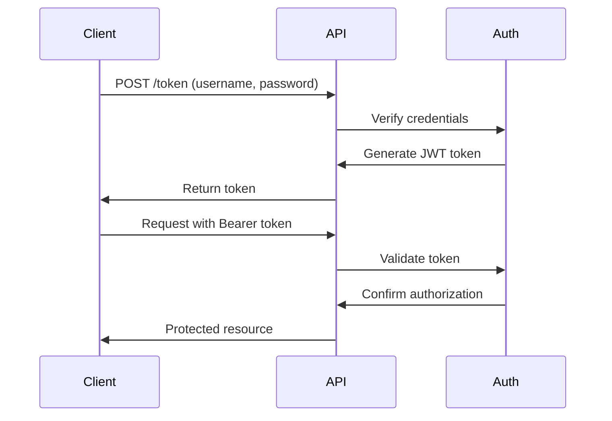

# Authentication System Documentation

## Overview
JWT-based authentication system with OAuth2 password flow for the FCA Company Categorization API.

## Implementation Details

### 1. Security Features
- JWT token authentication
- Password hashing (bcrypt)
- Token expiration
- Protected routes
- User status verification

### 2. Authentication Flow



### 3. Code Structure

```python
# Authentication configuration
SECRET_KEY = "your-secret-key"
ALGORITHM = "HS256"
ACCESS_TOKEN_EXPIRE_MINUTES = 30

# Token generation
def create_access_token(data: dict, expires_delta: Optional[timedelta] = None) -> str:
    to_encode = data.copy()
    expire = datetime.utcnow() + (expires_delta or timedelta(minutes=15))
    to_encode.update({"exp": expire})
    return jwt.encode(to_encode, SECRET_KEY, algorithm=ALGORITHM)

# Protected route example
@app.post("/categorize")
async def protected_route(
    current_user: User = Depends(get_current_active_user)
):
    # Route implementation
```

## Security Best Practices

### 1. Password Security
- Bcrypt hashing
- Salt generation
- Work factor configuration

### 2. Token Management
- Short expiration times
- Secure transmission
- Token validation

### 3. Route Protection
- Dependency injection
- Status verification
- Error handling

## Testing

### 1. Authentication Tests
```python
def test_login_success():
    response = client.post(
        "/token",
        data={"username": "testuser", "password": "testpass"}
    )
    assert response.status_code == 200
    assert "access_token" in response.json()

def test_protected_route():
    response = client.post(
        "/categorize",
        headers={"Authorization": f"Bearer {token}"}
    )
    assert response.status_code == 200
```

### 2. Security Tests
- Invalid credential handling
- Token expiration
- Authorization verification

## Error Handling

### 1. Authentication Errors
```json
{
    "detail": "Incorrect username or password"
}
```

### 2. Authorization Errors
```json
{
    "detail": "Could not validate credentials"
}
```

## Future Enhancements

### 1. Security Features
- Two-factor authentication
- Role-based access control
- Session management

### 2. User Management
- User registration
- Password reset
- Email verification

### 3. Monitoring
- Failed login tracking
- Suspicious activity detection
- Security alerts
